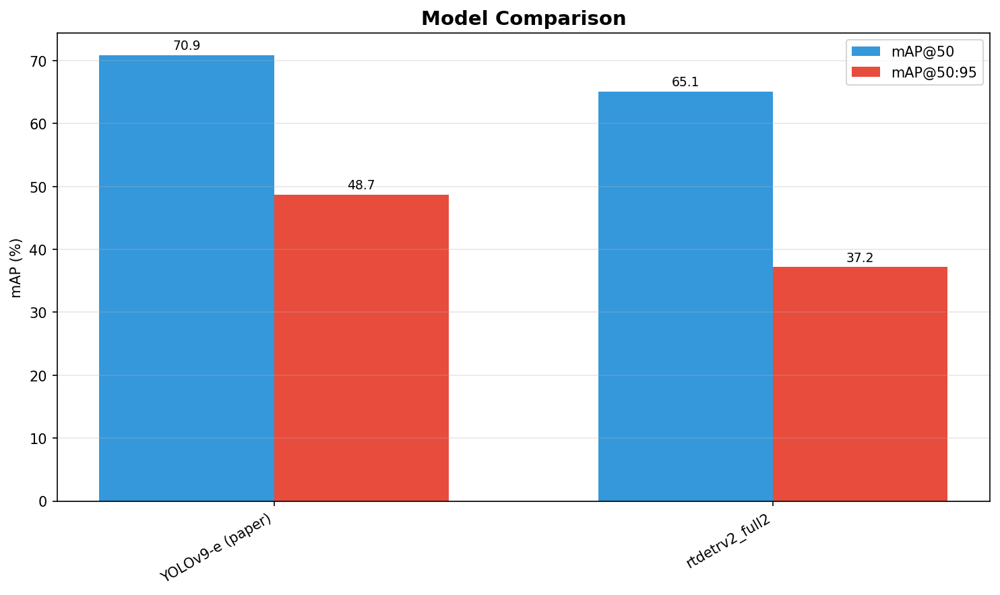

# PPE Compliance Detection on SH17 Dataset

Object detection for Personal Protective Equipment (PPE) compliance in manufacturing environments.

## Dataset — SH17

| | |
|---|---|
| Images | 8,099 (train 6,479 / val 1,620) |
| Instances | 75,994 |
| Classes | 17 |
| Image resolution | 2240×1808 to 8192×8192 (most common 4000×6000) |
| Class imbalance | 118× (hands: 15,850 vs face-guard: 134) |

Source: [SH17 Dataset](https://github.com/ahmadmughees/sh17dataset) by Ahmad Mughees et al.
Paper: [SH17: A Dataset for Human Safety and Personal Protective Equipment Detection](https://arxiv.org/abs/2407.04590)


### Classes

| ID | Class | Instances | Group |
|:--:|-------|----------:|-------|
| 0 | person | 13,802 | body part |
| 1 | ear | 7,730 | body part |
| 2 | ear-mufs | 318 | PPE |
| 3 | face | 8,950 | body part |
| 4 | face-guard | 134 | PPE |
| 5 | face-mask-medical | 670 | PPE |
| 6 | foot | 759 | body part |
| 7 | tools | 4,647 | other |
| 8 | glasses | 1,945 | PPE |
| 9 | gloves | 2,790 | PPE |
| 10 | helmet | 927 | PPE |
| 11 | hands | 15,850 | body part |
| 12 | head | 11,985 | body part |
| 13 | medical-suit | 157 | PPE |
| 14 | shoes | 4,560 | PPE |
| 15 | safety-suit | 240 | PPE |
| 16 | safety-vest | 530 | PPE |

## Models

Three architectures benchmarked against the YOLOv9-e baseline (70.9 mAP@50 from the original paper):

| Model | Type | Why |
|-------|------|-----|
| **YOLO11x** | CNN (Ultralytics) | Fast iteration, strong augmentation pipeline, SOTA in YOLO family |
| **RT-DETRv2-X** | Hybrid CNN-Transformer | End-to-end (no NMS), good at capturing global context between body parts and PPE |
| **DINO** | Transformer (mmdetection) | Deformable attention + contrastive denoising, strong on small objects |

## Results

| Model | mAP@50 | mAP@50-95 | Params (M) | Notes |
|-------|-------:|----------:|-----------:|-------|
| YOLOv9-e (paper baseline) | 70.9 | - | 58 | Reference from original SH17 paper |
| YOLOv9-e (ours) | 69.1 | 47.3 | 57.4 | |
| YOLO11x | 64.8 | 41,7 | 56.8 | |
| RT-DETRv2-X | 65.1 | 37.2 | 65.5 | |

See `evaluation/comparison.csv` for per-class AP and full comparison.


## Pretrained Weights

Trained model checkpoints are available on HuggingFace:
[anhnd210020/PPE-detection](https://huggingface.co/anhnd210020/PPE-detection)

```python
from huggingface_hub import hf_hub_download
from ultralytics import YOLO

# Download best YOLO11x weights
weights_path = hf_hub_download(repo_id="anhnd210020/PPE-detection", 
                                filename="weights/yolo11x_best.pt")
model = YOLO(weights_path)
results = model("path/to/image.jpg")
```

## Project Structure

```
PPE/
├── sh17.yaml               # dataset config (Ultralytics)
├── prepare_data.py          # create data layout + COCO annotations
├── train_yolo11x.py         # YOLO11x training (quick/full/finetune)
├── train_rtdetrv2.py        # RT-DETRv2-X training
├── train_dino.py            # DINO training (mmdetection)
├── evaluate.py              # evaluate + compare all models
├── analyze_sh17.py          # deep dataset analysis with plots
├── overview_sh17.py         # quick dataset summary
└── check_class_mapping.py   # verify class ID ↔ name mapping
```

## Setup

```bash
conda create -n ppe python=3.10 -y
conda activate ppe

# core
pip install torch torchvision --index-url https://download.pytorch.org/whl/cu121
pip install ultralytics>=8.3.0

# for DINO (optional)
pip install -U openmim
mim install mmengine mmcv mmdet

# evaluation
pip install pandas matplotlib seaborn scikit-learn pycocotools
```

## Usage

### 1. Prepare data

```bash
# edit paths in prepare_data.py if needed, then:
python prepare_data.py
```

Creates `data_ultralytics/` (symlinks for YOLO/RT-DETR) and `data_coco/` (COCO JSON for DINO).

### 2. Train

```bash
# quick sanity check (~1-2h on RTX 4090)
python train_yolo11x.py --mode quick

# full training (~12-18h)
python train_yolo11x.py --mode full
python train_rtdetrv2.py --mode full
python train_dino.py --mode full --backbone r50

# multi-GPU
python train_yolo11x.py --mode full --device 0,1
python train_dino.py --mode full --backbone swinl --gpus 2
```

### 3. Evaluate

```bash
python evaluate.py                           # all models
python evaluate.py --models yolo11x_full6    # specific model
```

## Key Challenges

**Small objects** — original images are 4000×6000+. Even at imgsz=1280 we downscale 3-5×. PPE items like ear-mufs and face-guard become just a few pixels.

**Class imbalance (118×)** — body parts (hands, head, face) dominate 70%+ of instances. Critical PPE classes like helmet (927), face-guard (134), medical-suit (157) are severely underrepresented.

**Visually similar classes** — medical-suit vs safety-suit, ear vs ear-mufs, foot vs shoes cause classification confusion.

## Training Strategy

- `imgsz=1280` (minimum for this dataset, 1536+ preferred if VRAM allows)
- `copy_paste=0.3` augmentation to boost minority classes
- `mosaic=1.0` with `close_mosaic=20` for better fine-tuning in final epochs
- `scale=0.5` for size variation robustness
- Cosine LR schedule with low initial LR (0.0005 for YOLO, 0.0001 for transformers)
- Early stopping with `patience=30`

## Hardware

- 2× NVIDIA RTX 4090 (24GB each)
- CUDA 13.0